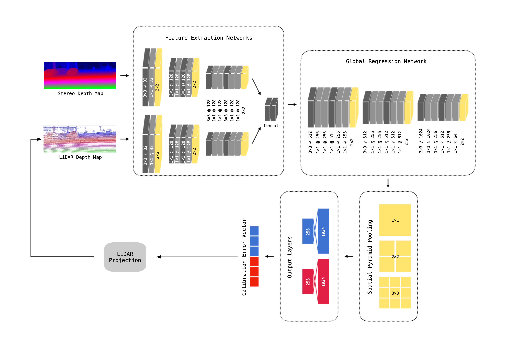
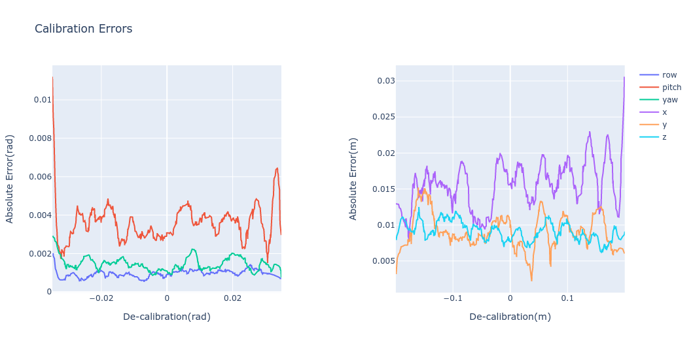
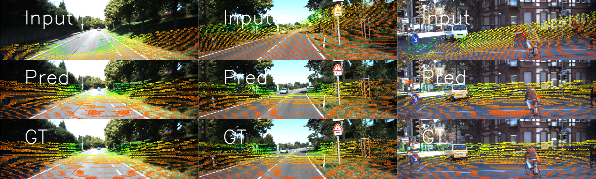
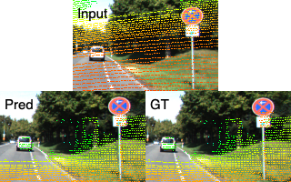

# This is The Way: Sensors Auto-calibration Approach Based on Deep Learning for Self-driving Cars

This work is accepted for publication in IEEE Sensors Journal.



In addition to the [original deep neural network architecture](https://github.com/simonwu53/NetCalib-Lidar-Camera-Auto-calibration), we added different losses to constrain the convergence of the model. Also, the preprocessing of dataset is required for fast training and convergence.

## Motivation
We are releasing our approach's source code for auto-calibrating camera and lidar sensors to share with the scientific community and industry with the aim of the collaboration with people around the world to push the boundaries in the field of autonomous driving and intelligent transportation systems. 

## Experiment results
### 1. Calibration Errors

The figure shows the comparison between decalibration (x-axis, artificial errors) and errors after auto-calibration (y-axis) for rotational and translational axes. 



### 2. Visualization





### 3. Speed
| Method | second per frame |
| ---  | --- |
| Ours | 0.0047 |
| [Go-ICP](https://github.com/yangjiaolong/Go-ICP) | 1.8221 |
| [RGGNet](https://github.com/KleinYuan/RGGNet) | 0.0244 |

## Deployment
### 1. System Environment

The method is tested based on the following setup, it may run on other setup as well. 
Version of packages may not necessarily fully match the numbers below.

| Env | Version |
| ---  | --- |
| System | 20.04 |
| Python | 3.8 |
| Numpy | 1.18.4 |
| PyTorch | 1.5.0 |
| torchvision | 0.6.0 |
| tqdm | 4.46.0 |
| Pillow | 7.1.2 |

For a full list of all dependencies, please visit [here](https://github.com/simonwu53/NetCalib2-Sensors-Auto-Calibration/blob/main/requirements.txt).

1. Clone the repo to your local drive. 
2. Setup your own Python environment and install necessary dependencies (using a virtual environment is recommended).
3. The installation of `pytorch` and `torchvision` may vary in the future because of variable CUDA versions, you can install manually via the [official website](https://pytorch.org/get-started/locally/).

### 2. Dataset
In general, the inputs for the model are a pair of a LiDAR projected depth map and a camera depth map of the same dimension.
[KITTI raw dataset](http://www.cvlibs.net/datasets/kitti/raw_data.php) from the date `26_09` is used and preprocessed before training. 
Drive `0005` and `0070` are split out for testing. 
Drive `0013`, `0020`, and `0079` are split out for validation.
The rest drives are used for training. 

For all drives, depth map (located in `image_c` folder) is calculated from stereo color images, 
and LiDAR depth map (located in `image_l` folder) is also calculated with an artificial error.  

The artificial errors are recorded (in `gt.txt` file) for each drive in the following format,
* img_filename, roll err, pitch err, yaw err, x err, y err, z err

Example for `gt.txt`:
```text
0000000000.png,0.14150073,0.059256576,0.011725272,0.16007939,-0.18555182,0.04104398
...
0000000107.png,-0.06508537,0.14815551,-0.15871142,0.07438427,0.09373859,0.12373618
```

The structure of the dataset should be organized like this:
```
├── KITTI ROOT
    └── train 
        └── 2011_09_26
            ├── 2011_09_26_drive_0001_sync
                ├── image_c
                    ├── 0000000000.png
                    ├── ...
                    └── 0000000107.png
                ├── image_l
                    ├── 0000000000.png
                    ├── ...
                    └── 0000000107.png
                └── gt.txt
            ├── 2011_09_26_drive_0002_sync
                └── ...
            ├── ...
            ├── calib_cam_to_cam.txt
            ├── calib_imu_to_velo.txt
            └── calib_velo_to_cam.txt
    ├── test
        └── 2011_09_26
            ├── 2011_09_26_drive_0005_sync
                └── ...
            ├── 2011_09_26_drive_0070_sync
                └── ...
            ├── calib_cam_to_cam.txt
            ├── calib_imu_to_velo.txt
            └── calib_velo_to_cam.txt
    └── val
        └── 2011_09_26
            ├── 2011_09_26_drive_0013_sync
                └── ...
            ├── 2011_09_26_drive_0020_sync
                └── ...
            ├── 2011_09_26_drive_0079_sync
                └── ...
            ├── calib_cam_to_cam.txt
            ├── calib_imu_to_velo.txt
            └── calib_velo_to_cam.txt
```

In `dataset_preprocessing/` folder, there's a utility script ([download.sh](https://github.com/simonwu53/NetCalib2-Sensors-Auto-Calibration/blob/main/dataset_preprocessing/download.sh), run at the folder you want to download) for downloading KITTI dataset 
***(Note: the script may not work as intended now).***
After downloading and unarchiving, the dataset should be reorganized as shown above.

There is another script ([preprocess.sh](https://github.com/simonwu53/NetCalib2-Sensors-Auto-Calibration/blob/main/dataset_preprocessing/preprocess.sh)) for generating both LiDAR depth maps and camera depth maps, but need ***a little modification***. 
You need to add your selected algorithm for camera depth in [preprocess.py](https://github.com/simonwu53/NetCalib2-Sensors-Auto-Calibration/blob/main/dataset_preprocessing/preprocess.py) in order to run the script. 

Note that the preprocessed camera depth images and projected LiDAR depth images should be cropped into the shape of **(352, 1216)** for height and width (dim 0 & 1) respectively.

### 3. Train the model
Modify the configurations in `src/train.sh` and read the available parameters from `src/train.py`. 
Run the training process is as simple as run the following command after configured the parameters.

```shell script
bash train.sh
```

In order to continue training, you should modify the configuration in `train.sh` to use the checkpoint file you have saved.

### 4. Test the model
You can test the trained model by the command below,

```shell script
python eval.py --ckpt path/to/ckpt.tar --visualization --rotation_offsest 10 --translation_offsest 0.2
```

* Use `--visualization` flag to show the video feed window (OpenCV required).
* `--rotation_offsest` and `--translation_offsest` used during the training process are required to correctly recognize the output from the model.

## Licence 
NetCalib is released under a [MIT License](https://github.com/simonwu53/NetCalib2-Sensors-Auto-Calibration/blob/main/LICENSE) license. 

For a closed-source version of NetCalib for commercial purposes, please contact the authors: [Wu](mailto:Shan.Wu@ut.ee) and [Hadachi](mailto:hadachi@ut.ee)


## Contributors
Shan Wu; Amnir Hadachi; Damien Vivet; Yadu Prabhakar.  

## Citation 
If you use NetCalib in an academic work, please cite:
```
@article{wu2021this,
  title={This is The Way: Sensors Auto-calibration Approach Based on Deep Learning for Self-driving Cars},
  author={Shan, Wu; Hadachi, Amnir; Vivet, Damien; Prabhakar, Yadu},
  journal={IEEE Sensors Journal},
  year={2021},
  publisher={IEEE}
}
```

Published paper is [here](https://ieeexplore.ieee.org/document/9599702).


